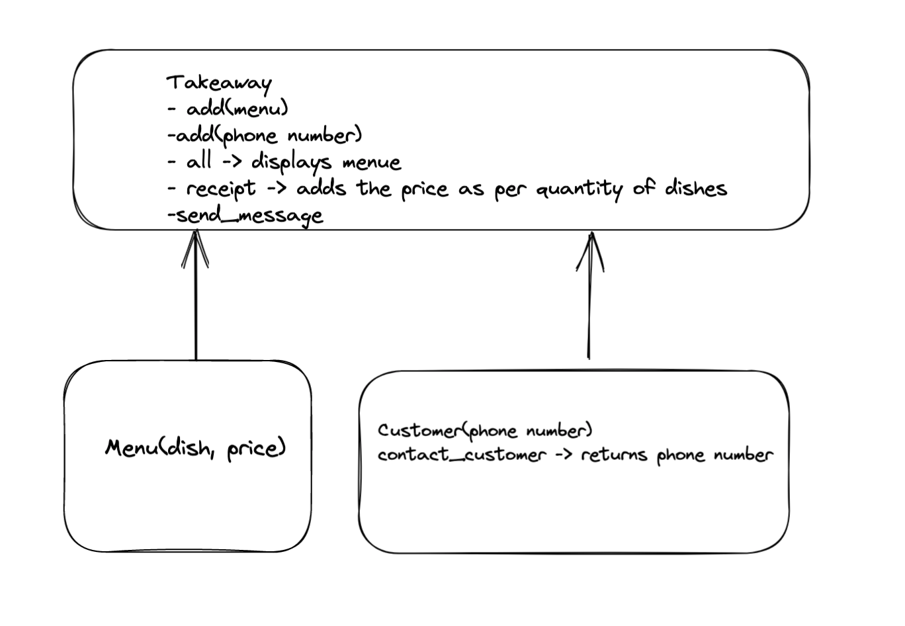

# Solo Project

> ## 1. Describe the Problem
> a. Customer needs a menu with a list of dishes with proces.
> b. Customer should be able to select number of several available dishes
> c. Customer would like to get a itemised receipt with grand total.
> d. Customer should be assured via text message such as "Thank you! Your order was placed and will be delivered before 18:52" after I have ordered."

 ## 2. Design the Class System
> 

Takeaway ----> add_menu(menu), add_phone(phone_number), all(displays menu), order, receipt (returns the itemised receipt for the order and grand total), send_message
Menu ---> dish, price
Customer(phone_number) ---> returns phone number
> 
> ## 3. Create Examples as Integration Tests
> take_away = Takeaway.new
menu_1 = Menu.new("pizza", 5)
take_away.add_menu(menu_1)
expect(take_away.all).to eq [menu_1]

> take_away = Takeaway.new
menu1 = Menu.new("pizza", 5)
menu2 = Menu.new("pasta", 5)
menu2 = Menu.new("roll", 5)
take_away.add_menu(menu1)
take_away.add_menu(menu2)
take_away.add_menu(menu3)
expect(take_away.order).to eq [menu_1, menu_2]

 take_away = Takeaway.new
menu1 = Menu.new("pizza", 5)
menu2 = Menu.new("pasta", 5)
menu2 = Menu.new("roll", 5)
take_away.add_menu(menu1)
take_away.add_menu(menu2)
take_away.add_menu(menu3)
expect(take_away.receipt).to eq "Grand total: 10 for [menu_1, menu_2]"

Create examples of the classes being used together in different situations
> and combinations that reflect the ways in which the system will be used.
> 
> Encode one of these as a test and move to step 4.
> 
> ## 4. Create Examples as Unit Tests
> 
> Create examples, where appropriate, of the behaviour of each relevant class at
> a more granular level of detail.
> 
> Encode one of these as a test and move to step 5.
> 
> ## 5. Implement the Behaviour
> 
> For each example you create as a test, implement the behaviour that allows the
> class to behave according to your example.
> 
> Then return to step 3 until you have addressed the problem you were given. You
> may also need to revise your design, for example if you realise you made a
> mistake earlier.

Copy and fill out [this template](../resources/multi_class_recipe_template.md)
for each of the below exercises.

## Demonstration

[A video demonstration](https://www.youtube.com/watch?v=CkyhW3pNTUY&t=0s)

## Exercise

This is the big one! You might want to start a new RSpec project for this.

Use object-oriented design and test-driven development, backed up by your
debugging and pairing skills, to develop the following program.

> As a user  
> So that I can record my experiences  
> I want to keep a regular diary

> As a user  
> So that I can reflect on my experiences  
> I want to read my past diary entries 

> As a user  
> So that I can reflect on my experiences in my busy day  
> I want to select diary entries to read based on how much time I have and my
> reading speed

> As a user  
> So that I can keep track of my tasks  
> I want to keep a todo list along with my diary

> As a user  
> So that I can keep track of my contacts  
> I want to see a list of all of the mobile phone numbers in all my diary
> entries

Some pointers:

* Remember that user stories don't map to classes 1:1. You'll need to digest the
  full problem and then develop a multi-class system that meets the user's
  needs.
* Don't worry about user interface or input-output. That means you shouldn't be
  using `gets` and only use `puts` for debugging purposes.

## Example Solution

There are many ways to solve this exercise, but [here is an example
solution.](https://www.youtube.com/watch?v=CkyhW3pNTUY&t=2046s) Bear in mind
that once you look at it, you may be influenced by my approach and this may
affect how much learning you can get from this exercise. That said, I trust you
to make the right decision.

## Moving On

You've now completed all of the core challenges for this module.

> As a customer  
> So that I can check if I want to order something  
> I would like to see a list of dishes with prices.
> 
> As a customer  
> So that I can order the meal I want  
> I would like to be able to select some number of several available dishes.
> 
> As a customer  
> So that I can verify that my order is correct  
> I would like to see an itemised receipt with a grand total.

Use the `twilio-ruby` gem to implement this next one. You will need to use
doubles too.

> As a customer  
> So that I am reassured that my order will be delivered on time  
> I would like to receive a text such as "Thank you! Your order was placed and
> will be delivered before 18:52" after I have ordered.

Fair warning: if you push your Twilio API Key to a public Github repository,
anyone will be able to see and use it. What are the security implications of
that? How will you keep that information out of your repository?